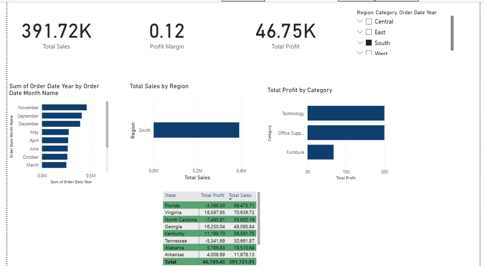

# 📊 Sales Performance Dashboard (Power BI)

## 🚀 Project Summary

This **interactive Power BI dashboard** analyzes Superstore sales and profit performance across regions, categories, and time.

It simulates the kind of weekly or monthly sales reporting dashboards that businesses use to monitor growth, track KPIs, and inform executive decisions.

---

## 🎯 Key Business Insights

- 💡 **Technology** leads in profitability despite lower volume  
- 🌍 **West** region has the highest sales overall  
- ⚠️ **High discounts** significantly lower profit margins  
- 🎄 **December** shows peak sales across regions  

---

## 🧠 Real-World Use Case

> At Wipro, I delivered 100+ custom Excel reports for client-facing dashboards.  
> This project shows how I now use **Power BI + Power Query + DAX** to automate and enhance that reporting for faster, smarter decision-making.

---

## 🛠️ Tools & Technologies Used

| Tool          | Purpose                                |
|---------------|----------------------------------------|
| Power BI      | Dashboard creation and interactivity   |
| Power Query   | Data cleaning & transformation         |
| DAX           | KPI and metric calculations            |
| Excel         | Raw data source                        |
| Superstore Dataset | Sample business data from Kaggle  |

---

## 📈 Features Implemented

- ✅ **Slicers** for Region, Category, Year  
- 📊 **KPI Cards** for Sales, Profit, Margin  
- 📅 **Monthly Trends** using line charts  
- 📦 **Category & Region Breakdown** with bar charts  
- 🌡 **State-wise Heatmap** using matrix visuals

---

## 📂 Project Structure

sales-performance-dashboard/
├── Sales_Performance_Dashboard.pbix
├── data/
│ └── Sample - Superstore.xlsx
├── screenshots/
│ ├── dashboard_full_view.png
│ └── kpi_section.png

---

## 📁 Dataset Source

[Kaggle: Superstore Dataset](https://www.kaggle.com/datasets/vivek468/superstore-dataset-final)  
Raw Excel file also included in `/data/`

---

## 📸 Dashboard Preview

---

## 🚀 How to Explore

1. Download the `.pbix` file  
2. Open in **Power BI Desktop**  
3. Use filters to interact with Region, Category, Year  
4. Explore insights through KPI cards, charts, and heatmaps

---

📬 **Looking to hire a business-minded analyst who builds clean, data-driven dashboards?**  
Connect on [LinkedIn](https://www.linkedin.com/in/ashwani-kumar-data-analyst) 

